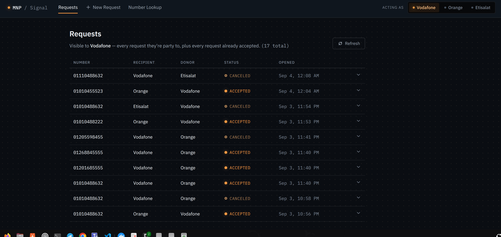
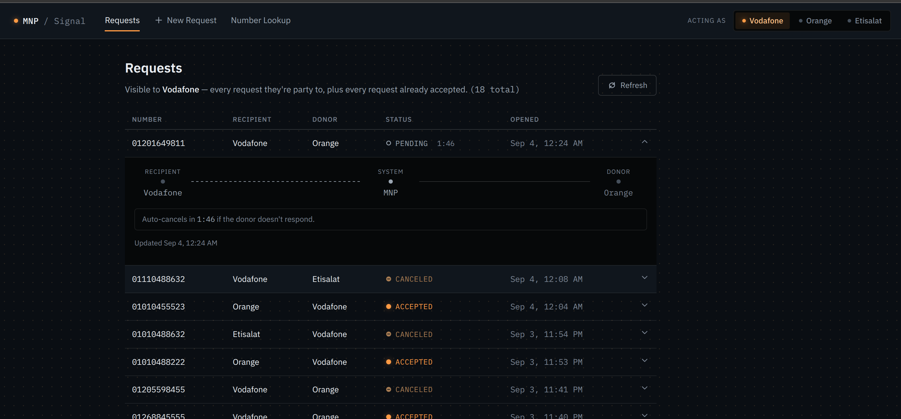
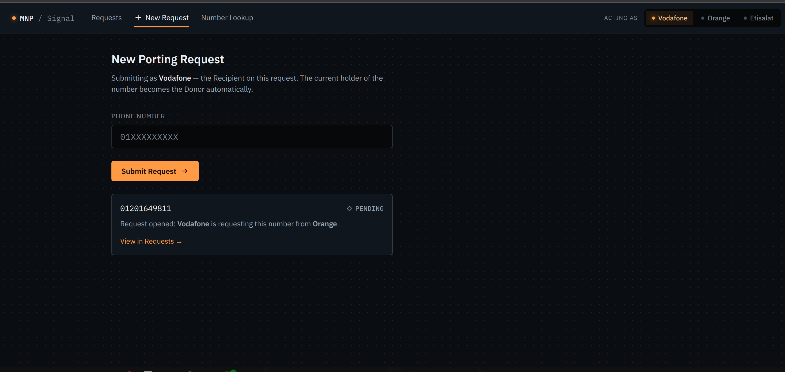
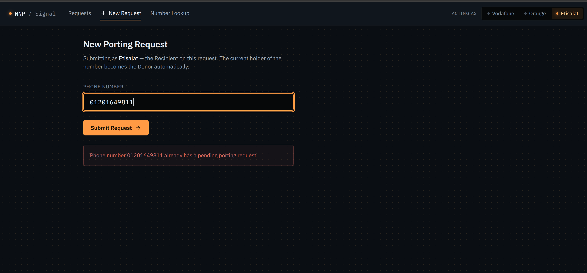
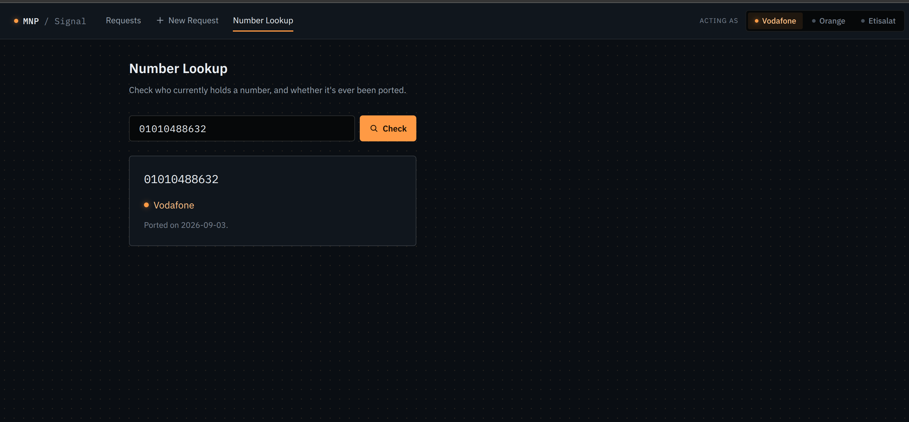

# Mobile Number Portability (MNP)

Internal operations console for Mobile Number Portability: submit, track, and
resolve number-porting requests between operators (Vodafone, Orange, Etisalat),
plus a number-status lookup. Angular 20 frontend + Spring Boot 4 / Java 17 REST
API + MySQL 8, all containerized.

## Architecture

| Service    | Container      | Published port        | Notes                                            |
| ---------- | -------------- | --------------------- | ------------------------------------------------ |
| `frontend` | `mnp-frontend` | `http://localhost:4200` | Angular app served by nginx                      |
| `app`      | `mnp-app`      | `http://localhost:8080` | REST API under `/api`, WebSocket under `/ws`     |
| `mysql`    | `mnp-mysql`    | `localhost:3307`      | Internal traffic stays on the compose network    |

The compose file lives at the repository root (`docker-compose.yml`). The database schema
is owned by `backend/MNP/db/init.sql`, which runs once on first MySQL startup
(data persists in the `mnp-mysql-data` volume afterwards). The backend waits for
MySQL's healthcheck before starting, and validates entities against the schema
(`ddl-auto=validate`) instead of altering it.

Auth is mocked: every request carries an `organization` header (`vodafone` /
`orange` / `etisalat`). Use the "Acting as" switch in the UI header.

## Live Demo

Quick access to the deployed app: **https://frontend-one-phi-98.vercel.app**

## Screenshots











## Prerequisites

- Docker Engine 24+ with the Compose v2 plugin (`docker compose version`)

No local JDK, Node, or MySQL installation is required — everything below runs in
containers.

## Build & run

From the repository root:

```bash
docker compose up --build -d
```

Then open `http://localhost:4200`.

Useful commands (run from the repository root):

```bash
docker compose ps                    # service status
docker compose logs -f app           # backend logs (follow)
docker compose logs -f frontend      # frontend logs (follow)
docker compose up -d --build app     # rebuild + restart backend only
docker compose stop                  # stop, keep data
docker compose down                  # stop + remove containers (keeps DB volume)
docker compose down -v               # stop + remove containers AND delete all DB data
```


## Versioning

Releases follow [Semantic Versioning](https://semver.org/): fixes bump the patch
segment (`v1.0.1`), backward-compatible additions bump minor (`v1.1.0`), breaking
API changes bump major (`v2.0.0`). Pre-release tags use the `-suffix` form
(e.g. `v1.0.0-dev`).
